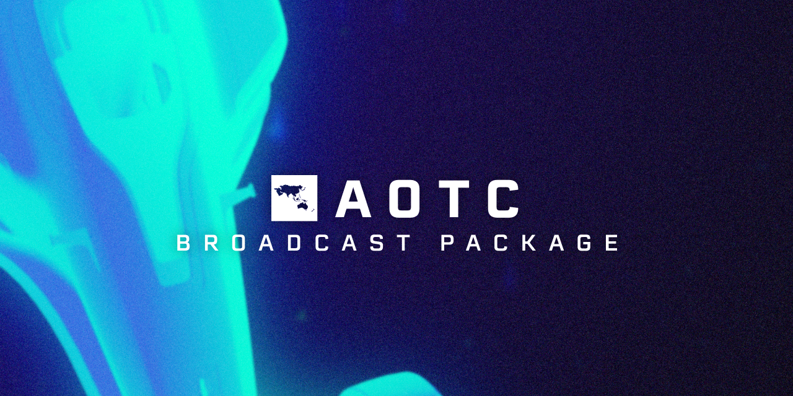

<p align="center">
  
</p>

# AOTC Broadcast Package

This is the source code for the AOTC broadcast package. To see it in action, watch one of the [main broadcasts](https://www.youtube.com/watch?v=39BRNL1tOqA).

## Developing

### Prerequisites

- [Git](http://git-scm.com/)
- [Node.js](https://nodejs.org/en/) (16.0.0+)
- [Yarn](https://classic.yarnpkg.com/) (1.x)
- Text Editor with [EditorConfig](http://editorconfig.org/) & [Prettier](https://prettier.io/) support. (We recommend [Visual Studio Code](https://code.visualstudio.com/))

### Environment variables

You will need to provide the following environment variables for local development. You will need service account credentials from Google to use the Google Spreadsheet API, you can [follow this guide](https://theoephraim.github.io/node-google-spreadsheet/#/getting-started/authentication?id=service-account) to create your own.

```
GOOGLE_SHEETS_ID= # the spreadsheet ID of the dashboard spreadsheet
GOOGLE_SERVICE_ACCOUNT_EMAIL= # the Service Account email given to you
GOOGLE_PRIVATE_KEY= # the private key received from your Service Account auth details
```

Create a copy of the `.env.example` file and name it `.env`. There, you can put the credentials you receive.

### Setting up

First, you should clone the repository.

```sh-session
$ git clone https://github.com/Trackmania-Asia-OCE/aotc-broadcast-package.git
```

After this repository has been cloned, `cd` into the repository:

```sh-session
$ cd aotc-broadcast-package
```

Install the project's dependencies. Note that we use Yarn, not npm:

```sh-session
$ yarn
```

### Starting a local server

To start developing locally, you have to run the development server.

```sh-session
$ yarn dev
ready - started server on 0.0.0.0:3000, url: http://localhost:3000
```
